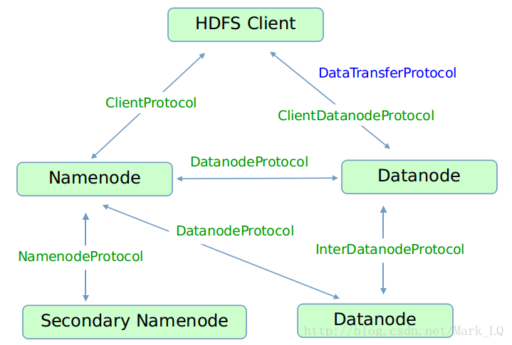
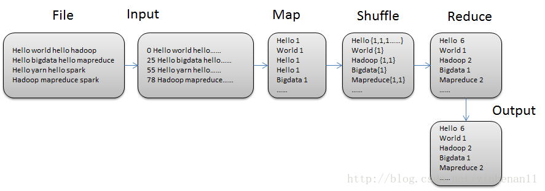
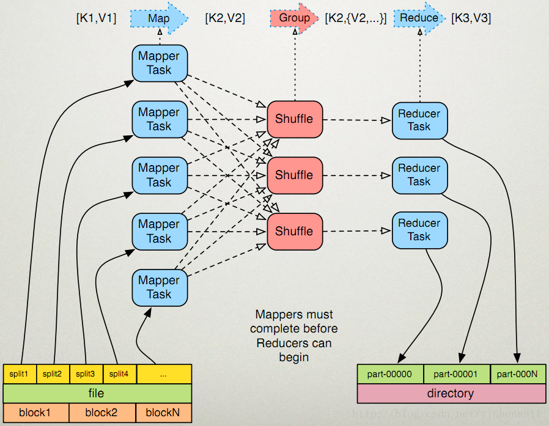

# HDFS
## 1. HDFS 体系结构
HDFS（Hadoop Distributed File System，Hadoop分布式文件系统）最开始作为Apache Nutch搜索引擎的基础架构而开发的，是Apache Hadoop Core项目的一部分。HDFS是一个可以运行在通用硬件上、<font color=#fe6673>提供流式数据操作</font>、处理超大文件的分布式文件系统。
HDFS是一个主/从（master/slave）体系结构的分布式系统，如下图所示。HDFS集群拥有一个Namenode和多个Datanode，用户可以通过 HDFS 客户端通 Namenode 和 Datanodes 交互以访问文件系统。


&emsp;&emsp;在 HDFS 中，Namenode 是 HDFS 的 Master 节点，<font color=#fe6673>负责管理文件系统的命名空间（namespace）和数据块到具体 Datanode 节点的映射等信息。</font>集群中的 Datanode一般是一个节点一个，<font color=#fe6673>负责管理 Datanode 所在节点上的数据存储。</font>从内部看，一个文件分成多个数据块（block）存储在一组 Datanode 上，其数据块与 Datanode 的映射信息存储在 Namenode 的 metadata 中，Datanode以本地文件的形式保存数据以及校验信息。

&emsp;&emsp;用户通过 HDFS 客户端发起读写 HDFS 文件的请求，同时可通过 HDFS 客户端对文件系统的命名空间操作，如打开、关闭、重命名文件或目录。

## 2. HDFS基本概念
### 2.1 数据块（Block）
&emsp;&emsp;HDFS 的数据块的概念与 Linux 文件系统（ext2、ext3）的数据块类似，是 HDFS 文件处理的最小单元。由于 HDFS 处理的文件比较大，为了最小化寻址开销，所以 HDFS 数据块也比较大，默认 128M。
```java
  public static final String  DFS_BLOCK_SIZE_KEY = "dfs.blocksize";
  // HDFS 的数据块的默认大小 128M
  public static final long    DFS_BLOCK_SIZE_DEFAULT = 128*1024*1024;
```
&emsp;&emsp;在 HDFS 中，所有文件都会被切分成若干数据块分布在数据节点上存储，同时每个数据块会冗余备份到不同的数据节点上（机架感知，默认保存3份）。
```java
  public static final String  DFS_REPLICATION_KEY = "dfs.replication";
  public static final short   DFS_REPLICATION_DEFAULT = 3;
```
&emsp;&emsp;HDFS 的读写操作中，数据块是最小单元。在读操作中，HDFS 客户端会首先请求 Namenode 获取包含该数据块的位置信息，然后根据数据块的位置信息进行读操作（流处理）。在写操作中，HDFS 客户端首先申请新的数据块，然后根据新申请的数据块的位置信息建立数据流管道写数据。
### 2.2 名字节点（Namenode）
&emsp;&emsp;名字节点（Namenode）管理文件系统的命名空间（namespace），包括文件目录树、文件/目录信息以及数据块索引（映射信息）等，这些信息保存在<font color=#fe6673>命名空间镜像文件（fsimage）</font>和<font color=#fe6673>编辑日志文件（editlog）</font>。同时名字节点还保存数据块与数据节点的映射关系，这些信息是在名字节点启动时动态构建的，即<font color=#fe6673>映射关系保存在内存中</font>。

&emsp;&emsp;名字节点是 HDFS的单一故障点，Hadoop 2.x 引入了名字节点高可用性（HA）的支持。在 HA 实现中，同一个 HDFS 集群中会配置两个名字节点——<font color=#fe6673>活动名字节点（Active Namenode）和备用名字节点（Standby Namenode）</font>。活动名字节点发生故障时，备用名字节点可立即切换为活动状态。

&emsp;&emsp;名字节点的内存中保存了文件系统的命名空间和数据块的映射信息，所以在集群中文件数据量很大的时候，名字节点的内存将成为限制系统横向扩张的瓶颈。为解决这个问题，Hadoop 2.x 引入了联邦 HDFS 机制（HDFS Federation）。联邦 HDFS 机制可以添加名字节点实现命名空间的扩展，每个名字节点管理文件系统命名空间的一部分，作为独立的命名空间卷（namespace volume）。
### 2.3 数据节点（Datanode）
&emsp;&emsp;数据节点是 HDFS 中的从节点，数据节点会根据 HDFS 客户端请求或 Namenode 调度将新的数据块写入本地存储，或读出本地存储上保存的数据块。

&emsp;&emsp;<font color=#fe6673>数据节点会不断向名字节点发送心跳信息、数据块汇报以及缓存汇报等信息，名字节点会通过心跳、数据块汇报以及缓存汇报的响应（Datanode调用汇报信息接口的返回值）向数据节点发送指令，数据节点执行这些指令，如创建、删除或复制数据。</font>
### 2.4 客户端
&emsp;&emsp;HDFS 提供了多种客户端接口供应用程序及用户使用，包括命令行接口、HTTP 接口、API 接口，使用这些接口可以很方便地使用 HDFS，而不需要考虑底层实现细节。

&emsp;&emsp;这些 HDFS 客户端接口的实现建立在 `DFSClient` 类的基础上，`DFSClient` 类封装了客户端与 HDFS 其他节点间的复杂交互。
### 2.5 HDFS 通信协议
&emsp;&emsp;HDFS 涉及数据节点、名字节点和客户端之间的配合、相互调用，为了降低节点间代码的耦合性，提高单个节点代码的内聚性，HDFS 将这些节点间的通信抽象成不同的接口。HDFS 节点间的接口主要有如下两种：



- <font color=#fe6673>Hadoop RPC 接口：HDFS 中基于 Hadoop RPC 框架实现的接口；</font>
- <font color=#fe6673>流式接口：HDFS 中基于 TCP 或者 HTTP 实现的接口，主要用于数据的读写；</font>

## 3. Hadoop 集群如何动态新增节点和删除节点？
（1）动态增加节点
- 新增节点的 Hadoop 版本要一致；
- 从已有集群中 clone 一份集群的配置文件到新增节点
- 修改 master 的 etc/hadoop/slaves 文件，添加新增的节点的域名或ip
- 在新增的节点分别启动 DataNode 和 NodeManager，Master 通过心跳连接实现新节点的加入

（2）动态删除节点
- 配置启用动态删除节点，在etc/hadoop/ 目录下添加 excludes 文件，加入要输出节点的域名或ip；
- master 节点修改 hdfs 和 yarn 的配置，指定 exclude 的文件地址；
- master 节点上执行 `./bin/hadoop dfsadmin -refreshNodes`
- 删除节点上可终止 datanode 和 nodemanager 进程
- 运行 `./sbin/start-balancer.sh` 均衡 block

## 4. HDFS 文件读写过程
（1）HDFS读取文件过程


（2）HDFS写文件过程


## 5. MapReduce 计算模型？
MapReduce主要包含五大模块Input，Map，Shuffle，Reduce，Output。



整个WordCount的MapReduce过程如上图:
- （1）首先从文件中以键值对的形式读取数据，默认键为行偏移量，值为一行的字符串；
- （2）接着进入Map端。每一次在 Map 端读取的都是一行字符串，我们先将它按空格分隔，并循环逐一输出。输出的键值对为（字符串，1）（因为MapReduce的整个过程都是以键值对的形式进行的，所以在Map端的输入输出都是键值对）；
- （3）进入shuffle过程，这个过程包括 **分区、排序、分组等等过程**；在这里我们只关注分组，shuffle 过程默认把相同 key 的 value 值存入一个组中，然后将一个迭代器作为值传入reduce端；
- （4）reduce收到shuffle过程传来的键值对为，key-字符串，value-迭代器；我们在reduce阶段循环将迭代器中的数字“1”累加，最后的到一个和，那么这个和就是最终的单词数；
- （5）将单词和对应的单词数输出到文件中。



## 6. Hadoop Streaming的优缺点?
- 优点
  - 可以使用自己喜欢的语言来编写MapReduce程序（换句话说，不必写Java XD）
  - 不需要像写Java的MR程序那样import一大堆库，在代码里做一大堆配置，很多东西都抽象到了stdio上，代码量显著减少
  - 因为没有库的依赖，调试方便，并且可以 **脱离Hadoop先在本地用管道模拟调试**
- 缺点
  - 只能通过命令行参数来控制MapReduce框架，不像Java的程序那样可以在代码里使用API，控制力比较弱，有些东西鞭长莫及
  - 因为中间隔着一层处理，效率会比较慢

- 所以Hadoop Streaming比较适合做一些简单的任务，比如用python写只有一两百行的脚本。如果项目比较复杂，或者需要进行比较细致的优化，使用Streaming就容易出现一些束手束脚的地方。
