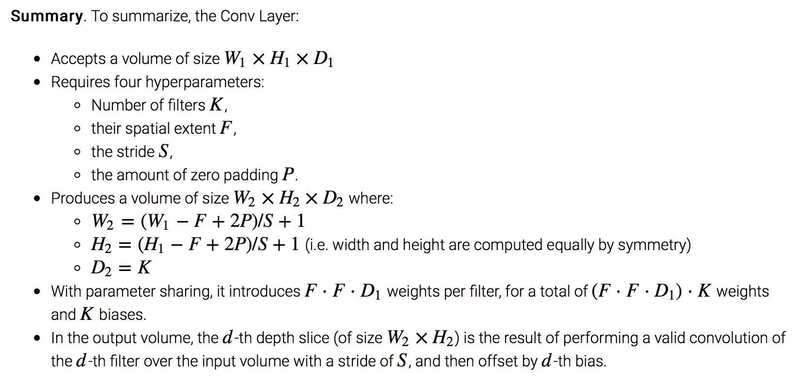
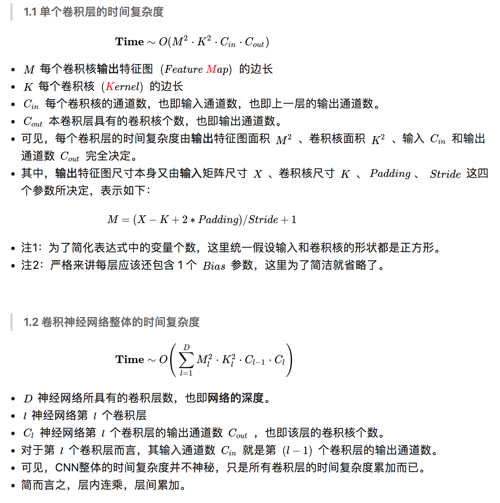
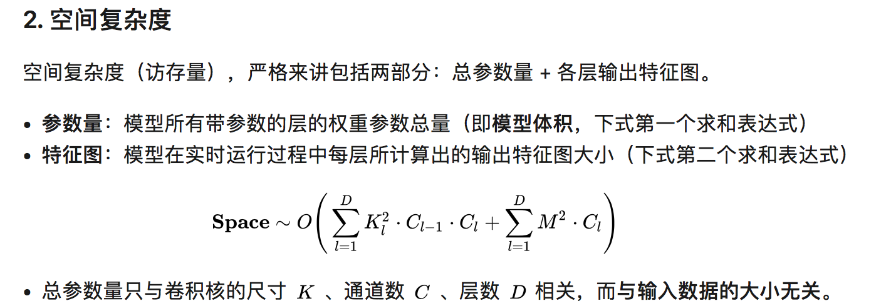

# Convolutional Neural Network
## 1. CNN 中的卷积，以及卷积的动机是什么？:star::star::star:
（1）神经网络中的卷积

神经网络中的卷积通常是指由多个并行卷积组成的运算。一般而言，每个核只用于提取一种类型的特征，尽管它作用在多个空间位置上。而我们通常希望网络的每一层能够在多个位置提取多种类型的特征。卷积的一些基本概念：通道（channel）、卷积核（kernel、filter）、步幅（stride，下采样）、填充（padding）。

（2）卷积的动机

卷积运算通过三个重要的思想来帮助改进机器学习系统：稀疏连接（sparse connectivity）、参数共享（parameter sharing）、等变表示（equivariant representations）。

- 稀疏连接（sparse connectivity）：提高了模型的统计效率：原本一幅图像只能提供少量特征，现在每一块像素区域都可以提供一部分特征；减少了模型的存储需求和计算量，因为参数更少。
- 参数共享（parameter sharing）：针对每个feature map，所使用的 filter 是共享的。卷积运算中的参数共享保证了我们只需要学习一个参数集合，而不是对于每一位置都需要学习一个单独的参数集合。
- 平移等变|不变性（translation invariant）：参数共享（和池化）使卷积神经网络具有一定的平移不变性。平移不变性关心某个特征是否出现而不关心它出现的具体位置。

## 2. 卷积中不同零填充有什么影响？:star::star:
三种零填充设定，其中 m 和 k 分别为图像的宽度和卷积核的宽度（高度类似）：
- 有效（valid）卷积：不使用零填充，卷积核只允许访问那些图像中能够完全包含整个核的位置，输出的宽度为 m − k + 1.
    - 在这种情况下，输出的所有像素都是输入中相同数量像素的函数，这使得输出像素的表示更加规范。
    - 然而，<font color='red'>输出的大小在每一层都会缩减，这限制了网络中能够包含的卷积层的层数。</font>（一般情况下，影响不大，除非是上百层的网络）
- 相同（same）卷积——只进行足够的零填充来保持输出和输入具有相同的大小，即输出的宽度为 m.
    - 在这种情况下，只要硬件支持，网络就能包含任意多的卷积层。
    - 然而，<font color='red'>输入像素中靠近边界的部分相比于中间部分对于输出像素的影响更小。这可能会导致边界像素存在一定程度的欠表示。因为边界部分的像素点包含很多的 0 元素，卷积操作输出主要受边界像素的影响。</font>
- 全（full）卷积——进行足够多的零填充使得每个像素都能被访问 k 次（非全卷积只有中间的像素能被访问 k 次），最终输出图像的宽度为 m + k − 1.
    - 因为 same 卷积可能导致边界像素欠表示，从而出现了 Full 卷积；
    - 但是在这种情况下，输出像素中靠近边界的部分相比于中间部分是更少像素的函数。这将导致学得的卷积核不能再所有所有位置表现一致。
    - 事实上，很少使用 Full 卷积

## 3. 如何理解深度学习中的 deconvolution networks？
（1）什么是反卷积（deconvolution）
逆卷积相对于卷积在神经网络结构的正向和反向传播中做相反的运算。


（2）deconvolution 的应用
- unsupervised learning，其实就是covolutional sparse coding：这里的deconv只是观念上和传统的conv反向，传统的conv是从图片生成feature map，而deconv是用unsupervised的方法找到一组kernel和feature map，让它们重建图片。
- CNN可视化：**通过deconv将CNN中conv得到的feature map还原到像素空间，以观察特定的feature map对哪些pattern的图片敏感**，这里的deconv其实不是conv的可逆运算，只是conv的transpose，所以tensorflow里一般取名叫transpose_conv。
- upsampling：在pixel-wise prediction比如image segmentation以及image generation中，由于需要做原始图片尺寸空间的预测，而卷积由于stride往往会降低图片size， 所以往往需要通过upsampling的方法来还原到原始图片尺寸，deconv就充当了一个upsampling的角色。如GAN中的Generative图片生成。

## 4. 池化（Pooling）的作用）？
- <font color='red'>保留主要的特征同时减少参数和计算量，防止过拟合，提高模型泛化能力;</font>
- <font color='red'>invariance(不变性)</font>，这种不变性包括translation(平移)，rotation(旋转)，scale(尺度) 。更关注是否存在某些特征而不是特征具体的位置。可以看作加了一个很强的先验，让学到的特征要能容忍一些的变化。
- <font color='red'>使用池化可以看作是增加了一个无限强的先验：这一层学得的函数必须具有对少量平移的不变性。</font>当这个假设成立时，池化可以极大地提高网络的统计效率。这种无限强先验的影响： 卷积和池化可能导致欠拟合。
    - 与任何其他先验类似，卷积和池化只有当先验的假设合理且正确时才有用。
    - 如果一项任务涉及到要对输入中相隔较远的信息进行合并时，那么卷积所利用的先验可能就不正确了。
    - 如果一项任务依赖于保存精确的空间信息，那么在所有的特征上使用池化将会增大训练误差。

    >因此，一些卷积网络结构 (Szegedy et al., 2014a) 为了既获得具有较高不变性的特征又获得当平移不变性不合理时不会导致欠拟合的特征，被设计成在一些通道上使用池化而在另一些通道上不使用。

## 5. 1*1 卷积核的作用
- （1）<font color='red'>实现跨通道的交互和信息整合</font>：1x1卷积实际上是对每个像素点，完全不考虑周边像素的关系，使用 MLP 在不同 channels 上进行组合实现信息整合；
- （2）<font color='red'>进行卷积核通道数的降维和升维</font>：3x3 卷积或者5x5卷积在几百个filter的卷积层上做卷积操作时相当耗时，所以1x1卷积在3x3卷积或者5x5卷积计算之前先降低维度；有的 short-cut 连接需要保证维度匹配，需要用1x1卷积降维和升维进行匹配；
- （3）<font color='red'>引入非线性</font>：1x1 卷积可以在保持 feature map 尺寸不变（即不损失分辨率）的前提下大幅增加非线性特性，可以把网络做得很deep，从而提高网络的表达能力。

## 6. CNN中卷积层的计算细节
卷积层尺寸的计算原理
- 输入矩阵格式：四个维度，依次为：样本数、图像高度、图像宽度、图像通道数
- 输出矩阵格式：与输出矩阵的维度顺序和含义相同，但是后三个维度（图像高度、图像宽度、图像通道数）的尺寸发生变化。
- 权重矩阵（卷积核）格式：同样是四个维度，但维度的含义与上面两者都不同，为：卷积核高度、卷积核宽度、输入通道数、输出通道数（卷积核个数）
- 输入矩阵、权重矩阵、输出矩阵这三者之间的相互决定关系
  - 卷积核的输入通道数（in depth）由输入矩阵的通道数所决定。
  - 输出矩阵的通道数（out depth）由卷积核的输出通道数所决定。
  - 输出矩阵的高度和宽度（height, width）这两个维度的尺寸由输入矩阵、卷积核、扫描方式所共同决定。计算公式如下。
- <font color='red'>假设 Input size `W`, Filter size `F`, Padding size `P`，则结果卷积之后的输出大小为 `(W−F+2P)/S+1`</font>



Tensorflow 的实现代码：
```python
def conv_layer(x, out_channel, k_size, stride, padding):
    in_channel = x.shape[3].value
    w = tf.Variable(tf.truncated_normal(shape=[k_size, k_size, in_channel, out_channel], mean=0, stddev=stddev))
    b = tf.Variable(tf.zeros(out_channel))
    y = tf.nn.conv2d(x, filter=w, strides=[1, stride, stride, 1], padding=padding)
    y = tf.nn.bias_add(y, b)
    y = tf.nn.relu(y)
    return y
```

## 7. CNN 卷积神经网络的时间复杂度和空间复杂度分析


```python
def conv2d(img, kernel):
    height, width, in_channels = img.shape
    kernel_height, kernel_width, in_channels, out_channels = kernel.shape
    out_height = height - kernel_height + 1
    out_width = width - kernel_width + 1
    feature_maps = np.zeros(shape=(out_height, out_width, out_channels))
    for oc in range(out_channels):   # Iterate out_channels, Cl
        for h in range(out_height):             # Iterate out_height, W
            for w in range(out_width):          # Iterate out_width, W
                for ic in range(in_channels):   # Iterate in_channels, Cl-1
                    patch = img[h: h + kernel_height, w: w + kernel_width, ic]
                    # K^2
                    feature_maps[h, w, oc] += np.sum(patch * kernel[:, :, ic, oc])

    return feature_maps
```

