# 深度学习基础
## 1. 为什么神经网络的权重需要随机初始化而不是全初始化为 0？都有哪些初始化方法？:star::star::star::star:
http://www.cnblogs.com/marsggbo/p/7462682.html

- 随即初始化打破神经网络的对称性

如果具有相同激活函数的神经元连接自相同的输入，如果具有相同的初始权重参数，模型将一直以相同的方式更新这两个单元，输出也会一样，方向传播计算的梯度也会一样，参数更新值也一样(w=w−α∗dw)。更一般地说，如果权重初始化为同一个值，神经网络将是对称的，意味着每个 layer 的每个神经元 neuro 学到的都是相同的特征，相当于每一层只有一个神经元，导致整个神经网络不够 powerful，退化为基本的线性分类器比如 logistic regression。
- 初始值的大小会对优化结果和网络的泛化能力产生较大的影响：更大的初始值有助于避免冗余的单元和梯度消失；但如果初始值太大，又会造成梯度爆炸。

- 初始化为小的随机数，用1/sqrt(n)校准方差

将权重初始化为很小的数字是一个普遍的打破网络对称性的解决办法，每个神经元的权重向量初始化为一个从多维高斯分布取样的随机向量，`W=0.01∗np.random.randn(D,H)`，其中`randn`是从均值为0的单位标准高斯分布进行取样。随机初始化神经元的输出的分布有一个随输入量增加而变化的方差，可以通过将其权重向量按其输入神经元个数的平方根进行缩放，从而将每个神经元的输出的方差标准化到1。即利用启发式方法(heuristic)将每个神经元的权重向量按下面的方法进行初始化:`w=np.random.randn(n)/sqrt(n)`，其中`n`表示输入神经元的数量，保证了网络中所有的神经元最初的输出分布大致相同，并在经验上提高了收敛速度。

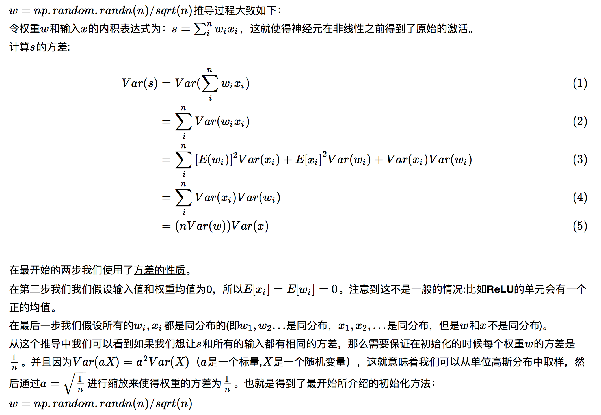

- Xavier initialization 建议方差缩放比例设为 `2/(nin+nout)`

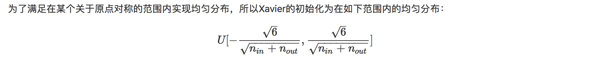

## 2. 什么是神经网络（MLP）的万能近似定理? 神经网络中，深度 Deep 与宽度 Wide 的关系，及其表示能力的差异？:star::star:
- 神经网络的万能近似定理认为神经网络具有至少一个非线性隐藏层，那么只要给予网络足够数量的隐藏单元，它就可以以任意的精度来近似任何从一个有限维空间到另一个有限维空间的函数。
- 隐藏层的数量称为模型的深度 Deep，隐藏层的维数（单元数）称为该层的宽度 Wide。
- 万能近似定理表明一个单层的网络就足以表达任意函数，但是该层的维数可能非常大，且几乎没有泛化能力；此时，使用更深的模型能够减少所需的单元数，同时增强泛化能力（减少泛化误差）。参数数量相同的情况下，浅层网络比深层网络更容易过拟合。
- 增加深度(layer number)和广度(neurol number)，都是在增加可学习参数的个数，从而增加网络的拟合能力。实际上在网络设计时，二者都会考虑，追求深度和广度的平衡。
- The main issue is that these **very wide, shallow networks are very good at memorization, but not so good at generalization**.The advantage of deep layers is that they can **learn features at various levels of abstraction**, going deeper allows the models to **capture richer structures**.

深度与宽度的区别：

https://www.zhihu.com/question/53976311
https://www.zhihu.com/question/53976311

- **表达能力**：在参数数目一定时，增加深度会比增加广度的表达能力更强一些，后面的层可以共享前面层的计算结果。就直观的量级来说，一个是线性增长一个是指数增长。但深度比较大的时候会比较难训练，因为有gradient vanishing和gradient explosion的问题。
- **参数数目**：假设每一层的各种超参数相同的话，把某一层的广度增加一倍时，参数数目增加了单层参数数目的两倍（前向和后向）；而增加一层的话，参数数目只增加了单层参数数目的一倍（只有后向）。
- **计算复杂度**：在同一个深度增加广度或者插入一层，增加的计算时间是类似的。对于卷积层来说，由于其复杂度和送入该层的图像尺寸有关，因此在越接近输入的地方增加广度，计算复杂度会增大不少。为了减少计算时间，目前大部分网络结构都是从上到下广度依次增加的，比如 filters 是逐渐增加的。

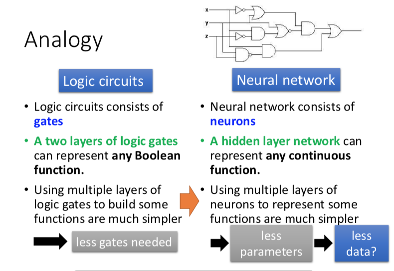
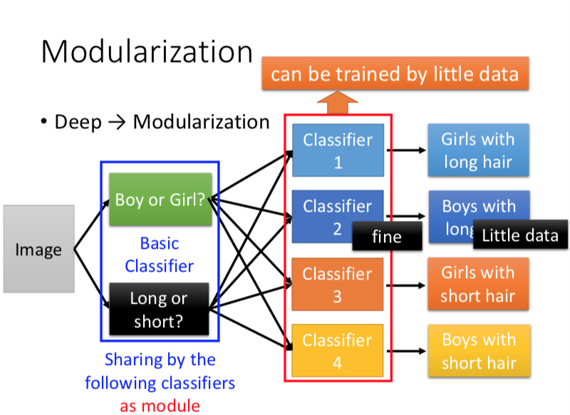

## 3. 在深度神经网络中，引入了隐藏层（非线性单元），放弃训练问题的凸性，其意义何在？:star:
- 深度学习的策略是学习一种非线性变换 ø，其中 ø 定义了一个隐藏层，非线性的引入放弃了损失函数的凸性，即放弃优化问题的最优解；
- **非线性单元的加入，使训练问题不再是一个凸优化问题**。这意味着神经网络很难得到最优解，即使一个只有两层和三个节点的简单神经网络，其训练优化问题仍然是 NP-hard 问题（神经网络变得越深，优化问题就会变得越难）。

但即使如此，使用神经网络也是利大于弊的：
- 只需要寻找正确的函数族即可，而不需要去寻找精确的函数。
- 使用简单的梯度下降优化方法就可以高效地找到足够好的局部最小值
- 增强了模型的学习/拟合能力，“maxout 单元可以以任意精度近似任何凸函数”。至于放弃凸性后的优化问题可以在结合工程实践来不断改进。 “似乎传统的优化理论结果是残酷的，但我们可以通过工程方法和数学技巧来尽量规避这些问题，例如启发式方法、增加更多的机器和使用新的硬件（如GPU）。”

## 4. 深度学习中的稀疏表示，低维表示，独立表示？:star:
无监督学习任务的目的是找到数据的“最佳”表示。“最佳”可以有不同的表示，但是一般来说，是指该表示在比本身表示的信息更简单的情况下，尽可能地保存关于 x 更多的信息。

低维表示、稀疏表示和独立表示是最常见的三种“简单”表示：
  - (1)低维表示尝试将 x 中的信息尽可能压缩在一个较小的表示中；
  - (2)稀疏表示将数据集嵌入到输入项大多数为零的表示中；
  - (3)独立表示试图分开数据分布中变化的来源，使得表示的维度是统计独立的。

这三种表示不是互斥的，比如主成分分析（PCA）就试图同时学习低维表示和独立表示。

## 5. 深度学习中模型容量，表示容量，有效容量，最优容量的概念？:star:
- **模型容量**： 指模型拟合各种函数的能力，可以控制模型是否过拟合或欠拟合。容量低的模型可能很难拟合训练集，产生欠拟合；容量过高会在训练集上可以很好的拟合目标函数，而不具备一定的泛化能力，导致过拟合。
- **表示容量**：在训练模型的过程中，我们通过调整参数来降低训练误差，模型决定了学习算法可以从哪些函数簇里选择；
- **有效容量**：在实际训练机器学习模型中，从表示容量中选择最优函数是非常困难的，比如我们要拟合一个三次函数，而我们选择的容量中可能包括四次多项式，其实有效容量里是没有四次幂的。实际上我们训练出来的模型只是一个可以大大降低训练误差的函数，并不可能完美，也就说学习算法的有效容量，可能会小于模型的表示容量。

## 6. 对于 softmax 和 sigmoid 类型的激活函数，为什么交叉熵损失函数能取得比均方误差损失函数更好的性能？:star::star::star:
（1）均方误差损失函数 Mean Squared Error

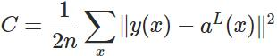

对应的权重更新为：

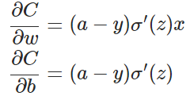

可以看出:
- w 和 b 的梯度跟激活函数的梯度成正比，激活函数的梯度越大，w和b的大小调整得越快，训练收敛得就越快。
- softmax 和 sigmoid 类型的激活函数存在饱和区，导致梯度很小，参数更新慢。

（2）交叉熵损失函数 Cross Entropy Error

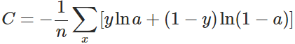

对应的权重更新为：

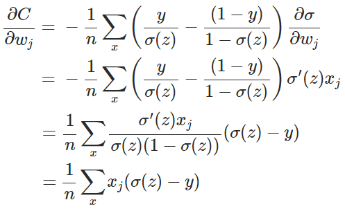

可以看出:
- 导数中没有σ′(z)这一项，权重的更新是受σ(z)−y这一项影响，即受误差的影响。所以当误差大的时候，权重更新就快，当误差小的时候，权重的更新就慢。

（3）MSE loss 和 cross-entropy loss 的损失函数图像大致如下：

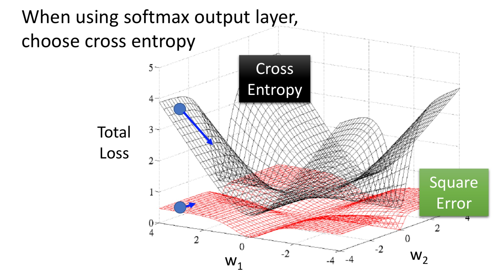

## 7. 为什么 ReLU 不是全程可微也能作为激活函数用于基于梯度的学习？为什么ReLu 的性能要比 tanh 和sigmoid 要好?:star::star::star::star:
Relu 可行性：

- Relu 在整个输入空间满足非线性，只是在输入大于0时为线性，信号与系统角度（傅立叶变换），通过整流引入了非线性；
- 虽然 ReLU 在 0 点不可导，但是它依然存在左导数和右导数，只是它们不相等（相等的话就可导了），于是在实现时通常会返回左导数或右导数的其中一个，而不是报告一个导数不存在的错误，TensorFlow 中选择 左导数 0，从 sparser matrix 角度考虑；

Relu 一般比 tanh 和 sigmoid 要好：

- 主要是因为它们gradient特性不同。sigmoid和tanh的gradient在饱和区域非常平缓，接近于0，很容易造成vanishing gradient的问题，减缓收敛速度。vanishing gradient在网络层数多的时候尤其明显，是加深网络结构的主要障碍之一；
- **采用sigmoid等函数，计算激活函数时（指数运算），计算量大，反向传播求误差梯度时，求导涉及除法，计算量相对大，而采用Relu激活函数，整个过程的计算量节省很多；**
- Relu会使一部分神经元的输出为0，这样就造成了 **网络的稀疏性，并且减少了参数的相互依存关系，缓解了过拟合问题的发生**；
- ReLU 的过程更接近生物神经元的作用过程。

## 8. 深度神经网络中为什么容易出现梯度爆炸和梯度弥散？:star::star::star::star:
梯度爆炸（exploding gradient）和梯度弥散（vanishing gradient）常出现于深度神经网络中。假设一个三层的神经网络，每层只有一个neuron：

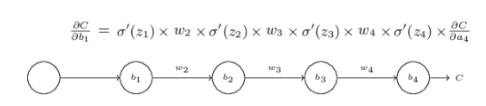

以 bias 为例，计算偏导：

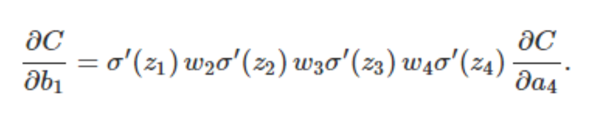

可以看出：W 的存在带来了梯度的缩放和放大的影响。
- 当 `|Wσ′(z)|>1`时容易出现梯度爆炸，所以权重一般初始化为 |W| < 1；
- 当`|Wσ′(z)|<1`时容易出现梯度弥散，特别时只对 sigmoid 类型的激活函数, 0 < σ′(z) < 1/4。

总结下：
- （1）从深度网络角度来说，不同层学习速度差异很大，表现为靠近输出层的梯度更新较快，而靠近输入层的梯度更新很慢。梯度小时和梯度爆炸的根本原因在于反向传播训练法则。  ==》Capsule 的提出
- （2）从激活函数的角度来说，sigmoid 和 tanh 函数均容易存在梯度消失的问题，其导数 σ′(z) < 1。  ==> Relu

## 9. 如何解决梯度爆炸和梯度弥散？:star::star::star::star:
- （1）逐层预训练加微调，采用无监督的方式逐层训练（如自编码器）
- （2）梯度剪切与正则化，梯度剪切针对梯度爆炸而言，限制梯度范围；正则化可以限制权重不会太大而导致的梯度爆炸。如 L1 正则使权重稀疏化，L2 正则通过权重衰减 weight decay。
- （3）激活函数的角度，采用 Relu、LeakRelu、elu 等，relu 的线性区域导数部分等于1，不容易产生梯度消失。
  Relu 的优势：
  - 解决了（缓解）梯度消失和爆炸的问题；
  - 计算方便
  - 加速网络的训练；

  Relu的缺点：
  - 负数输入恒为0，导致一些神经元无法激活（dead）
  - relu 存在输出偏置。
- （3）网络中使用 `Batch Normalizetion`，将前一层的输出规范化到均值为0，方差为1，保证各层输入分布基本相同，同时消除偏置的影响，避免神经元饱和，保证网络的稳定性。当输入分布不同时，layer 需要 adapt 不同的数据分布，使用 `BN` 后数据输入分布基本一致，加速网络的训练。
- （4）ResNet 中采用的残差连接，identity mapping 的方便梯度的传播。

- （5）LSTM 中采用 gate 机制，内部使用累加计算状态，其导数也是累加的，避免连乘造成梯度消失，状态 status 为直通的路线，有利于梯度的传播。

## 10. 深度学习中有哪些常用激活函数，各自的优缺点？:star::star::star::star:
（1）Logistic Shape 类型
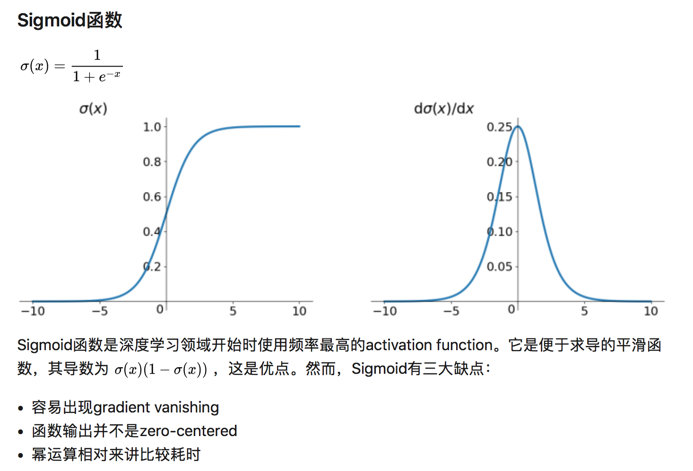
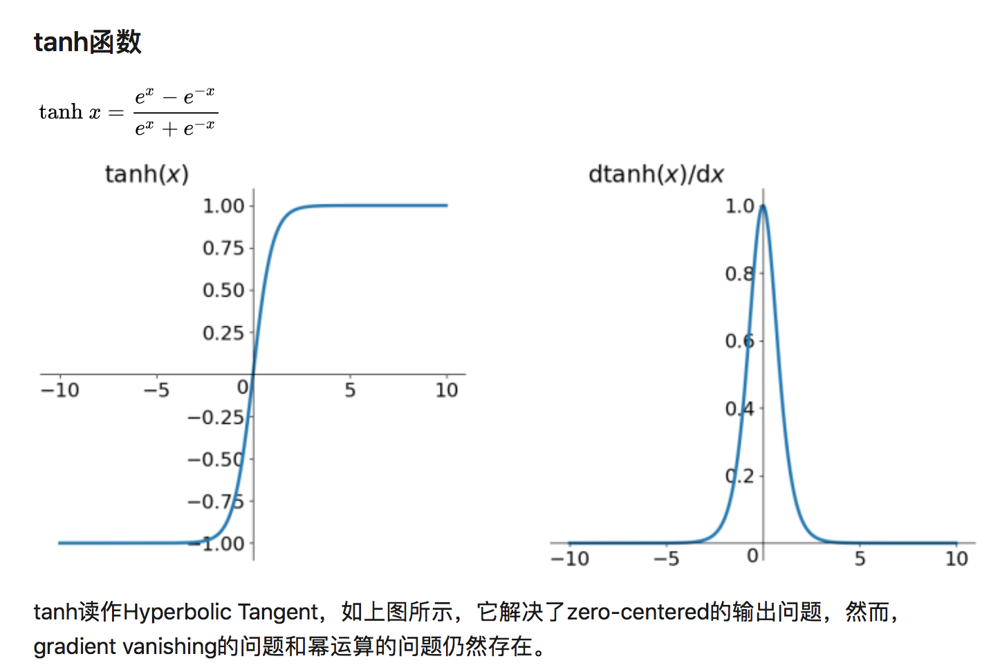

（2）Rectifier Shape 类型
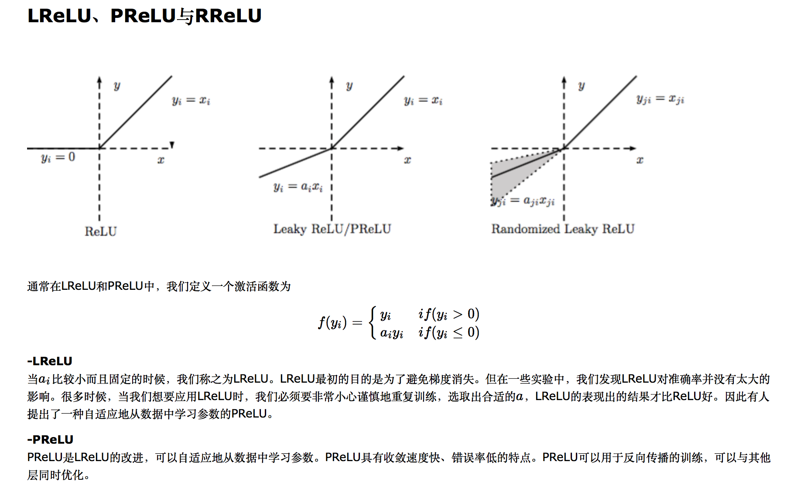
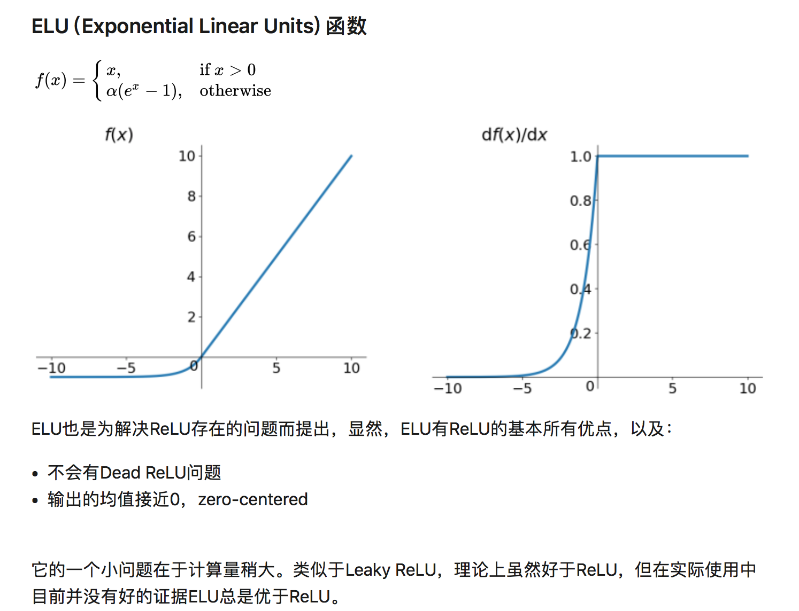

（3）Other 类型
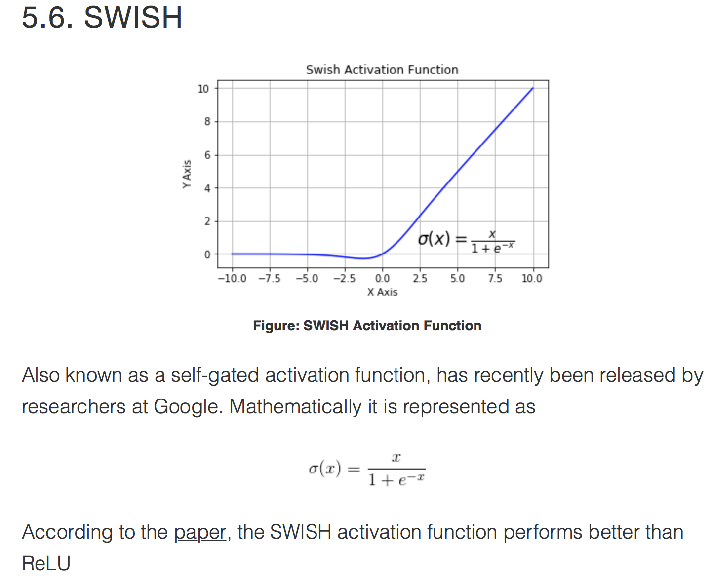

（4）选择合适的激活函数
- Sigmoid functions and their combinations generally work better in the case of shallow nerworks
- Sigmoids and tanh functions are sometimes avoided due to the vanishing gradient problem
- ReLU function is a general activation function and is used in most cases these days
- If we encounter a case of **dead neurons in our networks the leaky ReLU function is the best choice**
- Always keep in mind that ReLU function should only be used in the hidden layers
- As a rule of thumb, you can **begin with using ReLU function and then move over to other activation functions in case ReLU doesn’t provide with optimum results**

## 11. 解决过拟合的方法都有哪些？:star::star::star::star:
（1）模型出现过拟合现象的原因
- 训练集数据有噪声；
- 训练数据不足，有限的训练数据；
- 模型容量过大，参数过多，表达能力太强，导致模型非常复杂
- 模型针对训练集训练过度。

（2）避免过拟合的方法

<1> 从数据角度：
- **数据清洗**，过滤异常数据和 outlier 数据；
- **数据增强**，是解决过拟合最有效的方法，有时候往往拥有更多的数据胜过一个好的模型。模型利用训练集训练模型，预测未知的测试集以达到泛化，前提是假设训练集和测试集是独立同分布的，因此更多的训练数据往往模拟更准确；
- **增加噪声 Noise**：包括输入数据增加噪声、网络权重增加噪声，迫使模型学习更加鲁棒的特征；

<2> 从模型角度：
- **优化网络结构**：如减少网络层数和神经元的个数，降低网络的拟合能力；
- **集成学习**：Bagging、Boosting、Stacking 等方式进行多模型融合
- **添加BatchNormalization**：保证网络的 layer 的输入数据分布保持基本一致（即训练集和测试集 Input 到不同层的数据分布一致），降低数据之间的内部差异，去相关性减少数据之间的额绝对差异，突出相对差异，同时加快训练速度。
- **参数绑定和参数共享**：通过参数共享显著减少模型参数，降低模型复杂度，提高泛化能力。如 CNN 的卷积核，RNN 的 gate 权重都是全局参数共享的，Dropout 其实也是一种参数共享的方式。

<2> 从模型训练角度：
- **正则化方法**：在进行目标函数或代价函数优化时，在目标函数或代价函数后面加上一个正则项，降低模型的复杂度；（损失函数角度）
- **Dropout**：通过修改神经网络本身结构来实现的，训练阶段随机删除一些神经元，减少神经元之间的 co-adaptation，并且类似多模型融合的效果。
- **Early Stopping**：依据模型在验证集上的表现进行 Early Stop；
- **贝叶斯方法** 通过引入高斯先验（Gaussian prior）实现对于参数w（向量）的惩罚（L2范数），或则引入拉普拉斯先验实现对参数 W 的 L1 正则，有效防止过拟合的发生。

## 12. 为什么 Dropout 可以防止模型过拟合？:star::star::star:
- 减少神经元之间复杂的共适应性（prevents units from co-adapting too much）：因为dropout程序导致两个神经元不一定每次都在一个dropout网络中出现。（这样权值的更新不再依赖于有固定关系的隐含节点的共同作用，阻止了某些特征仅仅在其它特定特征下才有效果的情况）。 迫使网络去学习更加鲁棒的特征 （这些特征在其它的神经元的随机子集中也存在）。
- 起到模型融合（Bagging）的作用：Dropout的随机意味着每次训练时只训练了一部分，而且其中大部分参数还是共享的，可以看做训练了多个模型，实际使用时采用了模型平均作为输出。

Dropout与Bagging的不同点：

- **在 Bagging 的情况下，所有模型都是独立的；而在 Dropout 的情况下，所有模型共享参数，其中每个模型继承父神经网络参数的不同子集。**
- 在 Bagging 的情况下，每一个模型都会在其相应训练集上训练到收敛。而在 Dropout 的情况下，通常大部分模型都没有显式地被训练；取而代之的是，在单个步骤中我们训练一小部分的子网络，参数共享会使得剩余的子网络也能有好的参数设定。

## 13. 深度学习中 Batch Normalization 的作用？:star::star::star::star:
ref: https://www.zhihu.com/question/38102762/answer/85238569

（1）Internal Covariance Shift

**神经网络主要学习训练数据的分布，并在测试集上达到很好的泛化能力，但如果一个 batch 输入数据分布不一致，发生变化，会给模型训练带来一些困难**；另一方面数据结果一层层 layer 计算之后，其数据分布也发生着变化，此现象称为 Internal Covariance Shift（内部协变量漂移）。

**统计机器学习中的一个经典假设是“源空间（source domain）和目标空间（target domain）的数据分布（distribution）是一致的”。** 如果不一致，那么就出现了新的机器学习问题，如，transfer learning/domain adaptation等。而covariate shift就是分布不一致假设之下的一个分支问题，它是指源空间和目标空间的条件概率是一致的，但是其边缘概率不同，对于神经网络的各层输出，由于它们经过了层内操作作用，其分布显然与各层对应的输入信号分布不同，而且差异会随着网络深度增大而增大，可是它们所能“指示”的样本标记（label）仍然是不变的，这便符合了covariate shift的定义。

（2）Batch Normalization

BN 批规范化即在每次SGD时，通过 mini-batch 来对相应的 activation 的输入做规范化操作，使得结果（输出信号各个维度）的均值为0，方差为1，最后的“scale and shift”操作则是为了让因训练所需而“刻意”加入的 BN 能够有可能还原最初的输入，从而保证整个 network 的 capacity。（有关capacity的解释：实际上BN可以看作是在原模型上加入的“新操作”，这个新操作很大可能会改变某层原来的输入。当然也可能不改变，不改变的时候就是“还原原来输入”。如此一来，既可以改变同时也可以保持原输入，那么模型的容纳能力（capacity）就提升了。）

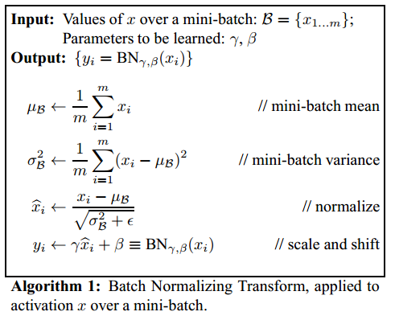

之所以最后一步的 scale 和 shift 是因为规范化到均值为 0，对于sigmoid 激活函数，`xi`几乎处于线性区域，因此要增加一个反变换，使能够有还原最初的输入分布。

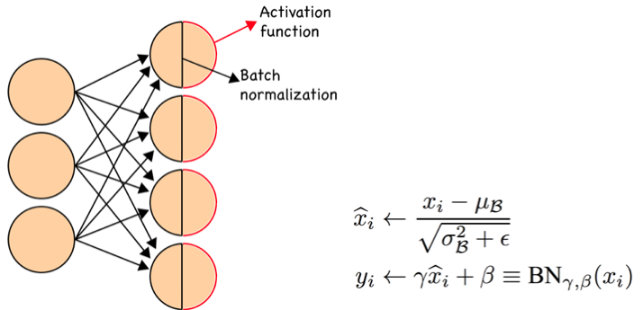

可以看出，`xi` represents the input feature and the output value in each hidden layer before activations. **BN 是加在 activitation 激活函数之前的，即保证 activitation 的输入分布基本一致。scale and shift 系数是超参数，参与模型训练，用于规范化之后试图还原原数据的分布（γ 和 ß 控制均值和方差）。**

（3）Why Batch Norm Works

BN 通过mini-batch来规范化某些层/所有层的输入，固定每层输入信号的均值与方差，保证网络训练的稳定性。其核心是 **为了防止梯度弥散和梯度爆炸**。

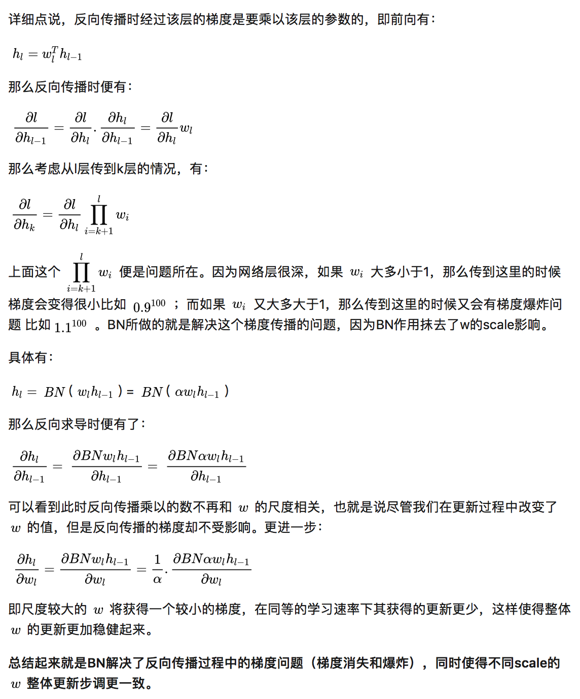

Thus, the gradient descent can reduce the oscillations when approaching the minimum point and converge faster.

## 14. 为什么考虑在模型训练时对输入层、隐藏层、权重以及输出层添加方差较小的噪声？神经网络中为增强模型泛化能力如何实现噪声鲁棒性的？:star::star::star::star:
在一般情况下，注入噪声比简单地收缩参数（L1、L2正则）强大。
- 输入层注入噪声

让机器学习泛化更好的办法最好的办法是使用更多的训练集训练模型。**在神经网络的输入层注入噪声也可以看作是数据增强的一种方式。** 如图像处理中对图像的旋转，剪切，混入噪声等方法。

- 隐藏层注入噪声

向隐藏层注入噪声可以看作是在多个抽象层进行数据集增强，**Dropout 策略可以看作是通过隐藏层与噪声相乘构建下一层新的输入的过程。**

- 权重注入噪声

另一种正则化模型的噪声使用方式是将其加到权重。这项技术主要用于循环神经网络。这可以被解释为关于 **权重的贝叶斯推断的随机实现**。**贝叶斯学习过程将权重视为不确定的，并且可以通过概率分布表示这种不确定性。向权重添加噪声是反映这种不确定性的一种实用的随机方法。**

## 15. 什么是深度学习中的病态? 如何避免？:star::star::star:

（1）什么是病态？

一般来说，ill-conditioned是指问题的条件数（condition number）非常大，从而比较难以优化，或者说需要更多迭代次数来达到同样精度。直观上来讲，条件数是：**函数梯度最大变化速度 / 梯度最小变化速度（对于二阶可导函数，条件数的严格定义是：Hessian矩阵最大特征值的上界 / 最小特征值的下界）。**

H 的条件数为：`λmax/λmin`，条件数越大,病态问题越严重。

用最简单的话来解释就是，问题条件数大意味着目标函数在有的地方（或有的方向）变化很快、有的地方很慢，比较不规律，从而很难用当前的局部信息（也就是梯度）去比较准确地预测最优点所在的位置，只能一步步缓慢的逼近最优点，从而优化时需要更多的迭代次数。

> (Mathematically, ill-conditioning is characterized by a high condition number. The condition number is the ratio between the largest and the smallest eigenvalue of the network's Hessian. The Hessian is the matrix of second derivatives of the loss function with respect to the weights. Although it is possible to calculate the Hessian for a multi-layer network and determine its condition number explicitly, it is a rather complicated procedure, and rarely done.)

如果网络的 H 的条件数很大，则网络是病态的（ill-conditioning）,可能呈现如下形式：

对于这样的网络，训练中存在的问题是对于不同的权重参数，需要的学习率可能不同，对于平坦的误差曲面需要较大的学习率来加速收敛，而这个较大的学习率可能在错误曲面的峡谷区发散，此时单一学习率的方法不能很好地训练模型。

（2）如何避免病态？

网络的病态问题通常与 **训练数据、网络结构以及网络的初始化权重有关。常见的问题是输入训练数据过大、网络层结构大小不一、初始权重过大或过小**。所以在网络训练之前需要进行precondition

> **Ill-conditioning in neural networks can be caused by the training data, the network's architecture, and/or its initial weights.** Typical problems are: having large inputs or target valuess, having both large and small layers in the network, having more than one hidden layer, and having initial weights that are too large or too small. This should make it clear that ill-conditioning is a very common problem indeed! In what follows, we look at each possible source of ill-conditioning, and describe a simple method to remove the problem. Since these methods are all used before training of the network begins, we refer to them as preconditioning techniques.

- Normalizing Inputs and Targets: (centering) subtract its average, then --> (scaling) divide by its standard deviation.
对输入和目标输出都归一化是考虑到前向传播和梯度的反向传播；
- Initializing the Weights ：合理初始化权重；
- 改进梯度下降算法：随机梯度下降（SGD）、批量随机梯度下降、自适应的学习率和带动量的 SGD等。

## 16. 自编码器在深度学习中的意义？
（1）自编码器的意义：
- 传统自编码器被用于**降维或特征学习**
- 近年来，**自编码器与潜变量模型理论的联系将自编码器带到了生成式建模的前沿**
    - 几乎任何带有潜变量并配有一个推断过程（计算给定输入的潜在表示）的生成模型，都可以看作是自编码器的一种特殊形式。

（2）自编码器的一般结构

- 自编码器有两个组件：编码器 f（将 x 映射到 h）和解码器 g（将 h 映射到 r）
- 一个简单的自编码器试图学习 g(f(x)) = x；换言之，自编码器尝试将输入复制到输出
- 单纯将输入复制到输出没什么用，相反，**训练自编码器的目标是获得有用的特征 h**。

（3）自编码器一些常见的变形与应用

欠完备自编码器

- **从自编码器获得有用特征的一种方法是限制 h 的维度比 x 小**，这种编码维度小于输入维度的自编码器称为欠完备（undercomplete）自编码器；
- 相反，如果 h 的维度大于 x，此时称为过完备自编码器。
- 学习 **欠完备的表示将强制自编码器捕捉训练数据中最显著的特征**
- 当解码器是线性的且 L 是均方误差，欠完备的自编码器会学习出与 PCA 相同的生成子空间
- 而**拥有非线性编码器函数 f 和非线性解码器函数 g 的自编码器能够学习出更强大的 PCA 非线性推广**
- 但如果编码器和解码器被赋予过大的容量，自编码器会执行复制任务而捕捉不到任何有关数据分布的有用信息。过完备自编码器就可以看作是被赋予过大容量的情况

正则自编码器

- 通过加入正则项到损失函数可以限制模型的容量，同时鼓励模型学习除了复制外的其他特性。
- **这些特性包括稀疏表示、表示的小导数、以及对噪声或输入缺失的鲁棒性。**
- 即使模型的容量依然大到足以学习一个无意义的恒等函数，**正则自编码器仍然能够从数据中学到一些关于数据分布的信息。**

稀疏自编码器

- 稀疏自编码器一般用来学习特征
- 稀疏自编码器简单地在训练时结合编码层的稀疏惩罚 Ω(h) 和重构误差：

- 稀疏惩罚不算是一个正则项。这仅仅影响模型关于潜变量的分布。这个观点提供了训练自编码器的另一个动机：这是近似训练生成模型的一种途径。这也给出了为什么自编码器学到的特征是有用的另一个解释：它们描述的潜变量可以解释输入。

去噪自编码器（DAE）

- **去噪自编码器试图学习更具鲁棒性的特征**
- 与传统自编码器不同，去噪自编码器（denoising autoencoder, DAE）最小化：

- 这里的 x~ 是被某种噪声损坏的 x 的副本，去噪自编码器需要预测原始未被损坏数据
- 破坏的过程一般是以某种概率分布（通常是二项分布）将一些值置 0.

