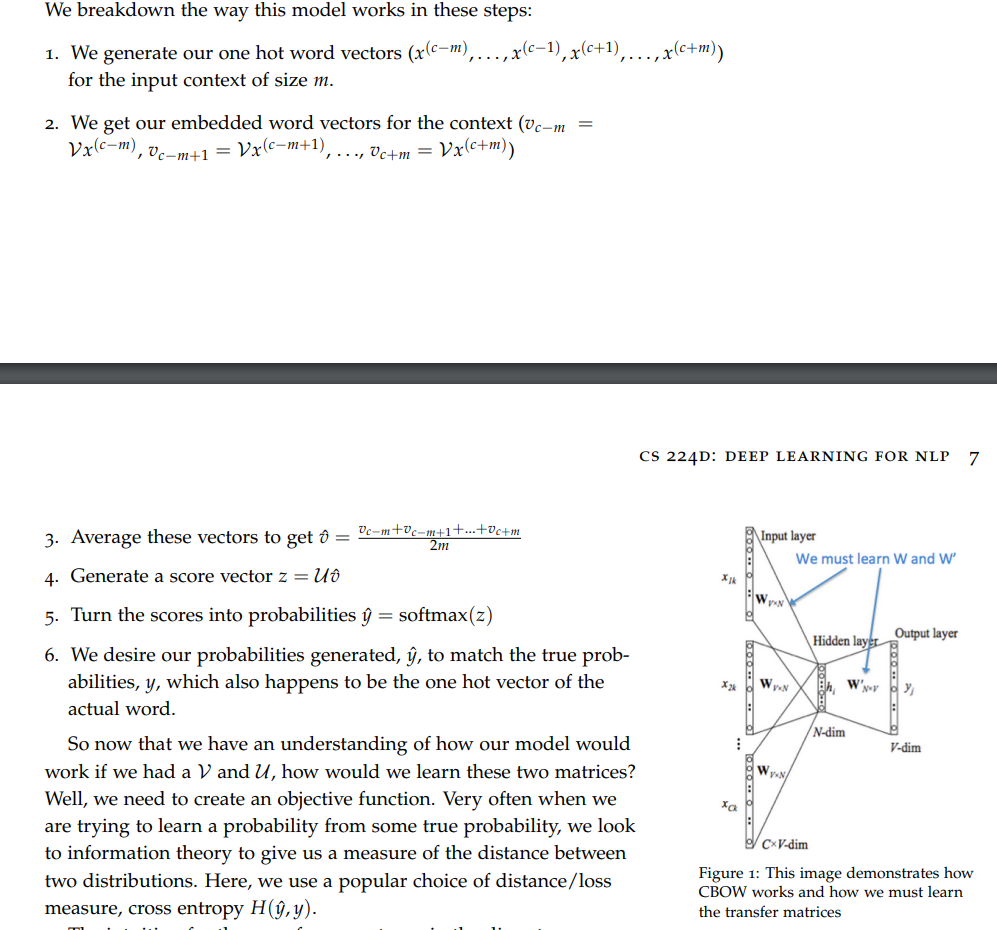
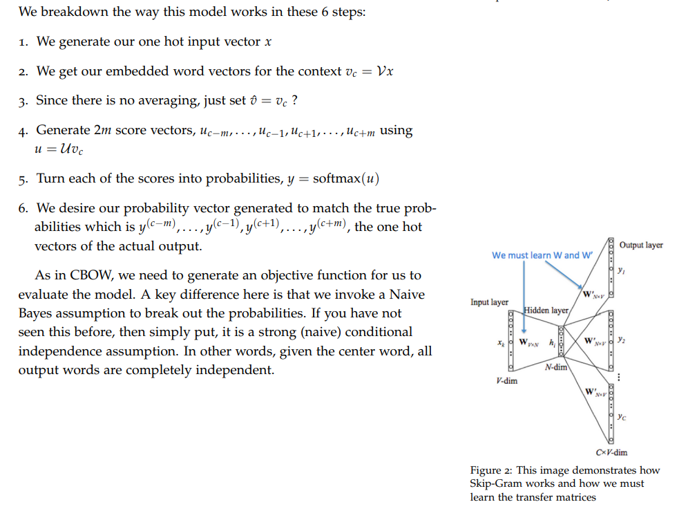

# Language Models
## 1. 神经语言模型（nnlm）和统计语言模型（n-gram）的异同点？
- 共同点：都是计算语言模型，将句子看作一个词序列，来计算句子的概率。
- 不同点：
  - 计算概率方式不同，**n-gram 基于马尔可夫假设只考虑前n个词**，**nnlm要考虑整个句子的上下文**
  - 训练模型的方式不同，**n-gram基于最大似然估计来计算参数，nnlm基于RNN的优化方法来训练模型，并且这个过程中往往会有word embedding作为输入，这样对于相似的词可以有比较好的计算结果，但n-gram是严格基于词本身的**
  - 循环神经网络可以将任意长度的上下文信息存储在隐藏状态中，而不仅限于n-gram模型中的窗口限制

## CBOW 和 Skip-gram 的原理
- CBOW

- Skip-gram

