# Optimization
## 1. 反向传播算法推导过程
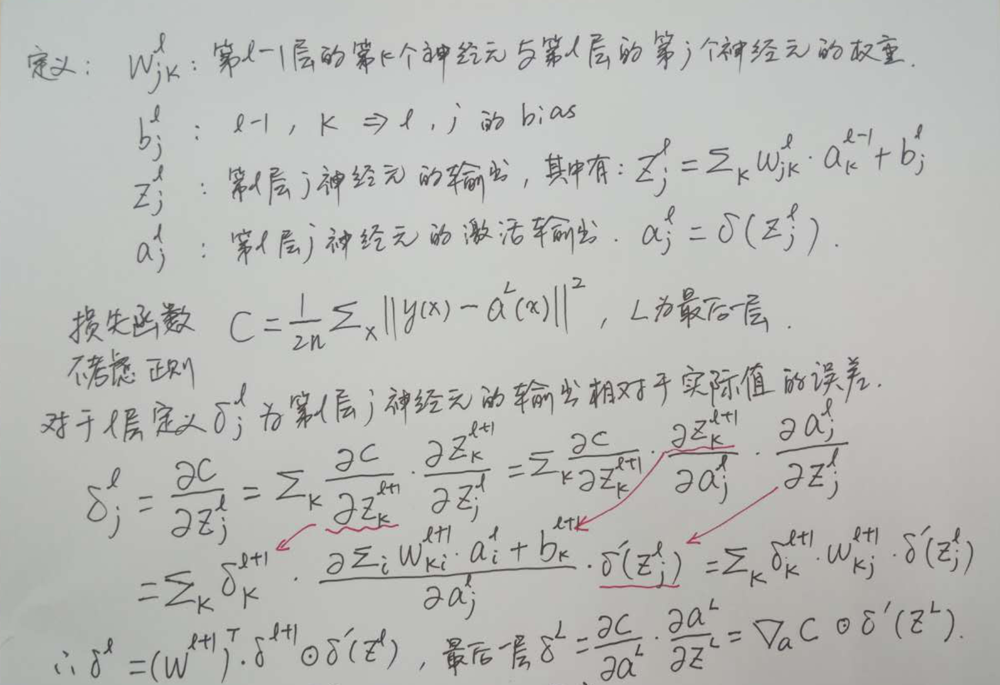
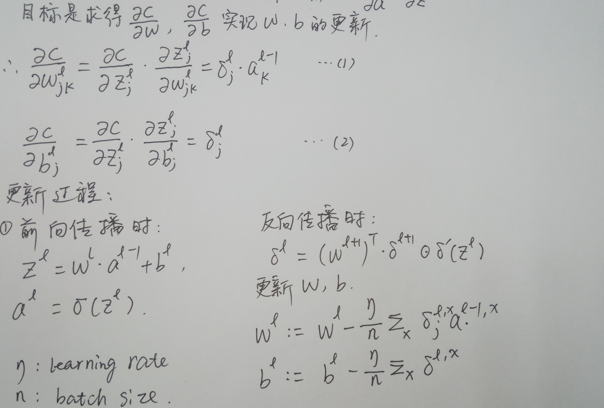

## 2. 基于二阶梯度的优化方法
**牛顿法**
- 梯度下降使用的梯度信息实际上是一阶导数
- 牛顿法除了一阶导数外，还会使用二阶导数的信息
>根据导数的定义，一阶导描述的是函数值的变化率，即斜率；二阶导描述的则是斜率的变化率，即曲线的弯曲程度——曲率

**几何理解**
- 牛顿法就是用一个二次曲面去拟合你当前所处位置的局部曲面；而梯度下降法是用一个平面去拟合当前的局部曲面。
- 通常情况下，二次曲面的拟合会比平面更好，所以牛顿法选择的下降路径会更符合真实的最优下降路径。

**通俗理解**
- 比如你想找一条最短的路径走到一个盆地的最底部，
- 梯度下降法每次只从你当前所处位置选一个坡度最大的方向走一步；
- 牛顿法在选择方向时，不仅会考虑坡度是否够大，还会考虑你走了一步之后，坡度是否会变得更大。
- 所以，牛顿法比梯度下降法看得更远，能更快地走到最底部。

**牛顿法的优缺点**

- 优点: 收敛速度快，能用更少的迭代次数找到最优解
- 缺点: 每一步都需要求解目标函数的 Hessian 矩阵的逆矩阵，计算复杂
>Hessian 矩阵即由二阶偏导数构成的方阵

## 3. 梯度下降算法的相关概念？面临哪些困难和挑战？各种改进的梯度下降算法脉络？
### （1）什么是梯度下降
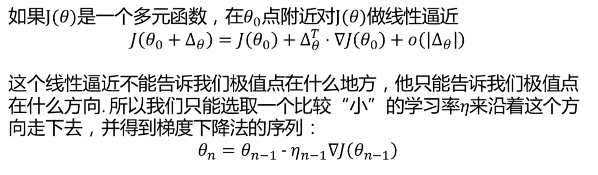

### （2）梯度下降的困难

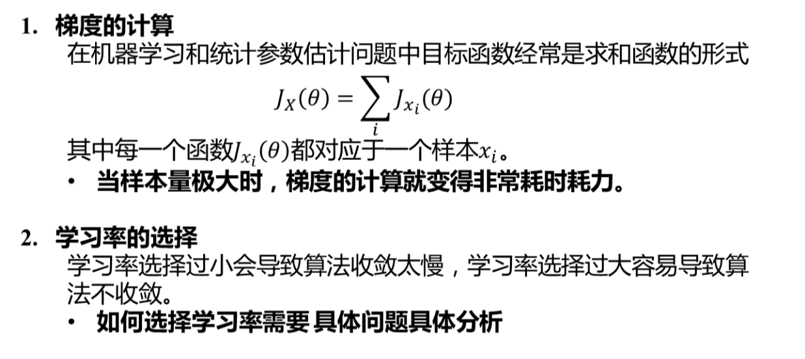

### （3）随机梯度下降法主要为了解决第一个问题:梯度计算

由于随机梯度下降法的引入，我们通常将梯度下降法分为三种类型:
- 批梯度下降法(GD)：原始的梯度下降法，使用所有样本数据计算梯度
- 随机梯度下降法(SGD)：每次梯度计算只使用一个样本
    - 避免在类似样本上计算梯度造成的冗余计算
    - 增加了跳出当前的局部最小值的潜力，同时注意为了保证梯度的稳定，需要使用较小的学习率
    - 在逐渐缩小学习率的情况下，有与批梯度下降法类似的收敛速度
- 小批量随机梯度下降法(Mini Batch SGD)：每次梯度计算使用一个小批量样本
    - 梯度计算比单样本更加稳定
    - 可以很好的利用现成的**高度优化的矩阵运算**工具

### （4）随机梯度下降法仍然面临第二个问题：学习率的选择
- 局部梯度的反方向不一定是函数整体下降的方向，或者说不是梯度下降最快的方向。
    - 对图像比较崎岖的函数，尤其是隧道型曲面，梯度下降表现为局部震荡下降；
- 预定学习率衰减的问题，学习率衰减法很难根据当前数据进行自适应。
- **对不同参数采取不同的学习率的问题**
    - 在数据有一定稀疏性时，希望对不同特征采取不同的学习率，梯度更新频繁的采用较小的学习率，梯度更新不频繁的采用较大的学习率；
- **神经网络训练中梯度下降法容易被困在鞍点附近的问题**
    - 比起局部极小值，鞍点更加可怕

### （5）为什么不用牛顿法?
- 牛顿法要求计算目标函数的二阶导数(Hessian matrix)，在高维特征情形下 Hessian 矩阵非常巨大，因为涉及到二阶导的全排列，计算和存储都成问题；
- 在使用小批量情形下，牛顿法对于二阶导数的估计噪音太大** `W:= W-alpha * f'/f''`，分母的二阶导数误差逐步放大
- **在目标函数非凸时，牛顿法更容易收到鞍点甚至最大值点的吸引，由于是用了二阶导数，所以容易被极值点吸引**；

### （6）随机梯度下降法的优化算法
#### (1)  **原始的SGD算法流程**
- 在训练集上抽取指定大小（batch_size）的一批数据 {(x,y)}
- 【前向传播】将这批数据送入网络，得到这批数据的预测值 y_p#FF8000
- 计算网络在这批数据上的损失，用于衡量 y_p#FF8000 和 y 之间的距离
- 【反向传播】计算损失相对于所有网络中可训练参数的梯度 gradient
- 将参数沿着负梯度的方向移动，具体来说，即 W -= lr * gradient

#### (2) **动量法（Momentum）**
引入动量的目的是为了加速 SGD 的学习过程——特别是针对高曲率、小但一致的梯度，或是 带噪声的梯度.

- 红线表示梯度下降的路径。这个非常细长的二次函数类似一个长峡谷。动量方法正确地纵向穿过峡谷，而普通的梯度方法则会浪费时间在峡谷的窄轴上来回移动。
- 可以看到开始曲率不大时，加入动量改进并不明显；但是在后半段曲率变高时，加入动量明显减少了迭代次数
- 动量方法以一种廉价的方式，在一定程度上模拟了牛顿法，牛顿法利用二阶导来确定梯度的方向，动量法利用动量修正梯度的方向；

**带动量的 SGD 算法描述**

  

- 从形式上看， 动量算法引入了变量 v 充当速度角色，以及相关的超参数 α；
- 之前，每次更新的步长只是梯度乘以学习率；现在，步长还取决于梯度序列的大小和排列；当许多连续的梯度指向相同的方向时，步长会被不断增大；
- 如果动量算法总是观测到梯度 g，那么它会在 −g 方向上不断加速，直到达到最终速度。
- 在实践中， α 的一般取 0.5, 0.9, 0.99。和学习率一样，α 也可以使用某种策略在训练时进行自适应调整；一般初始值是一个较小的值，随后会慢慢变大。

#### (3) **Nesterov accelerated gradient（动量法的改进算法）**
- 改进的动量算法，一般把使用 Nesterov 动量的优化算法称为 NAG (Nesterov accelerated gradient)
- 简单来说，NAG 把梯度计算在施加当前速度之后。
- 因此，Nesterov 动量可以解释为往标准动量方法中添加了一个修正因子。
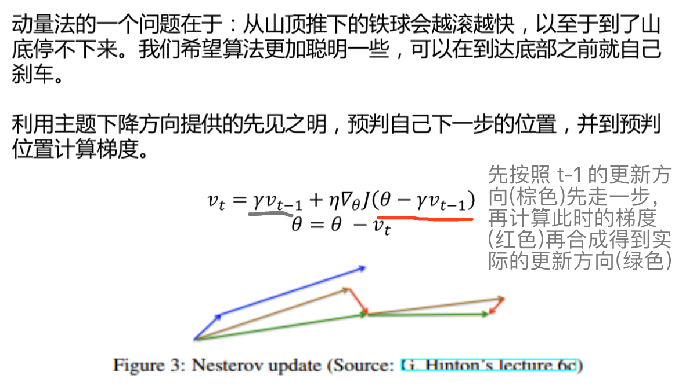

#### (4) **Adagrad (自动调整学习率，适用于稀疏数据)**
Adagrad 是一种自动调整学习率的方法：随着模型的训练，学习率自动衰减；对于更新频繁的参数，采取较小的学习率；对于更新不频繁的参数，采取较大的学习率；

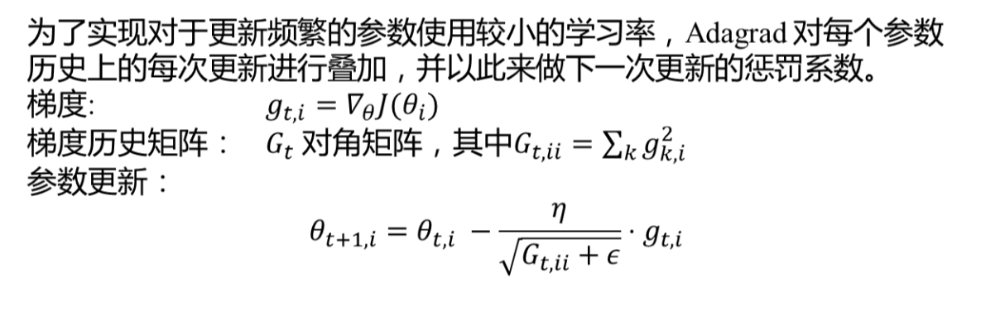
**AdaGrad 算法描述**

**AdaGrad 存在的问题**
- 学习率是单调递减的，训练后期学习率过小会导致训练困难，甚至提前结束
- 需要设置一个全局的初始学习率

#### (5) **RMSProp**
- RMSProp 主要是为了解决 AdaGrad 方法中学习率过度衰减的问题 —— AdaGrad 根据平方梯度的整个历史来收缩学习率，可能使得学习率在达到局部最小值之前就变得太小而难以继续训练；
- RMSProp 使用指数衰减平均（递归定义）以丢弃遥远的历史，使其能够在找到某个“凸”结构后快速收敛；此外，RMSProp 还加入了一个超参数 ρ 用于控制衰减速率。
> 所谓指数衰减平均，可以参考以下公式（仅做参考，具体实现未知）：
> 
>
> 可以看到越久之前的历史，影响会越小

- 具体来说（对比 AdaGrad 的算法描述），即修改 r 为
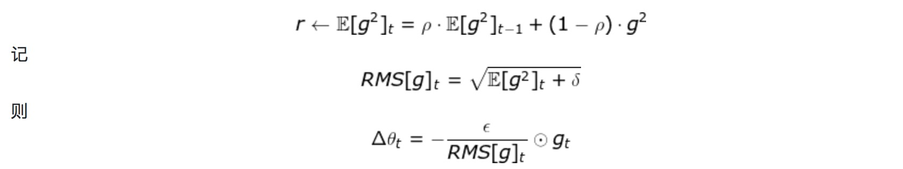
> 其中 E 表示期望，即平均；δ 为平滑项，具体为一个小常数，一般取 1e-8 ~ 1e-10（Tensorflow 中的默认值为 1e-10）
- RMSProp 建议的初始值：全局学习率 ϵ=1e-3，衰减速率 ρ=0.9

**RMSProp 算法描述**

**带 Nesterov 动量的 RMSProp**

- 经验上，RMSProp 已被证明是一种有效且实用的深度神经网络优化算法。
- RMSProp 依然需要设置一个全局学习率，同时又多了一个超参数
- RMSProp 建议的初始值：全局学习率 ϵ=1e-3，衰减速率 ρ=0.9。

#### (6) **Adadelta (Adagrad的改进算法)**
- AdaDelta 和 RMSProp 都是为了解决 AdaGrad 对学习率过度衰减的问题而产生的。
- AdaDelta 和 RMSProp 是独立发现的，AdaDelta 的前半部分与 RMSProp 完全一致；
- AdaDelta 进一步解决了 AdaGrad 需要设置一个全局学习率的问题

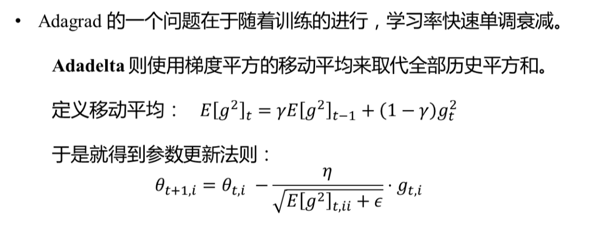
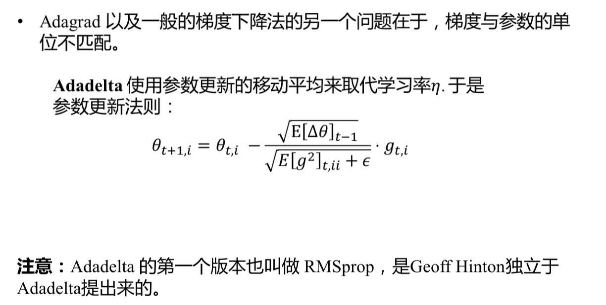

#### (7) **Adam（结合动量法和自适应学习率的Adadelta算法）**
- Adam 在 RMSProp 方法的基础上更进一步：
  - 除了加入历史梯度平方的指数衰减平均（r）外，
  - 还保留了历史梯度的指数衰减平均（s），相当于动量。
  - Adam 行为就像一个带有摩擦力的小球，在误差面上倾向于平坦的极小值。

**Adam 算法描述**

- 偏差修正
  - 注意到，s 和 r 需要初始化为 0；且 ρ1 和 ρ2 推荐的初始值都很接近 1（0.9 和 0.999）
  - 这将导致在训练初期 s 和 r 都很小（偏向于 0），从而训练缓慢。
  - 因此，Adam 通过修正偏差来抵消这个倾向。

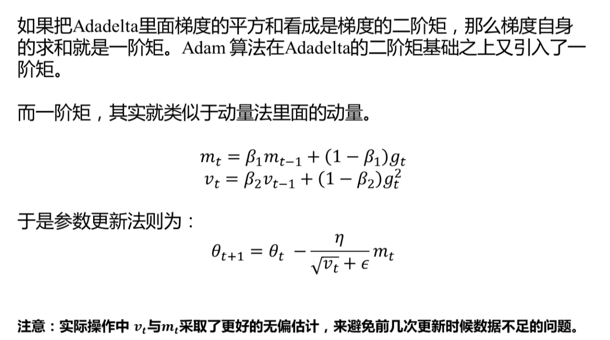

### （7）梯度下降算法如何选择
- **动量法与Nesterov的改进方法着重解决目标函数图像崎岖的问题**
- **Adagrad与Adadelta主要解决学习率更新的问题**
- **Adam集中了前述两种做法的主要优点**
- 目前为止 Adam **可能** 是几种算法中综合表现最好的

## 3. 批梯度下降法（Batch SGD）更新过程中，批的大小会带来怎样的影响？:star::star:
批的大小通常由以下几个因素决定：

- 较大的 Batch Size 能得到更精确的梯度估计，但回报是小于线性的。
- 较小的 Batch Size 能带来更好的泛化误差，原因可能是由于较小的batchsize 使得梯度波动较大，在学习过程中带来了噪声，使产生了一些正则化效果; 因为梯度估计的高方差，小批量训练需要较小的学习率以保持稳定性，这意味着更长的训练时间。
- 内存消耗和 Batch Size 的大小成正比，当批量处理中的所有样本可以并行处理时。
- 在一定范围内，**一般来说 Batch Size 越大，其确定的下降方向越准，引起训练震荡越小**
- 在某些硬件上使用特定大小可以减少运行时间。尤其是在使用 GPU 时，通常使用 2 的幂数作为批量大小可以获得更少的运行时间

## 4. 为什么 feature scaling 会使 gradient descent 的收敛更好?
- 提高gradient descent的收敛速度：对于gradient descent算法来说，learning rate的大小对其收敛速度至关重要。如果feature的scale不同，理论上不同的feature就需要设置不同的learning rate，但是gradient descent只有一个learning rate，这就导致不同feature的收敛效果不同，从而影响总体的收敛效果。所以在求解模型之前归一化不同feature的scale，可以有效提高gradient descent的收敛速度。
- 平滑特征对模型的影响程度：如果feature的scale相差很大，则会出现scale越大的feature，对模型的影响越大。比如对于multivariate regression, 极端情况下, 有一个特征的值特别特别大，其他特征的值都特别特别小，那么cost function就被这个特别大的特征主导，甚至退化为几乎单变量的模型。

## 5. 在梯度下降法中，为什么梯度的负方向是函数下降最快的方向？
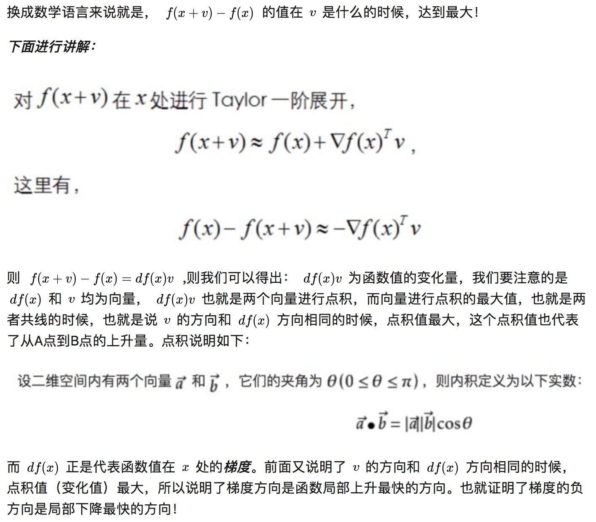

## 6. Be careful about turning down the learning rate
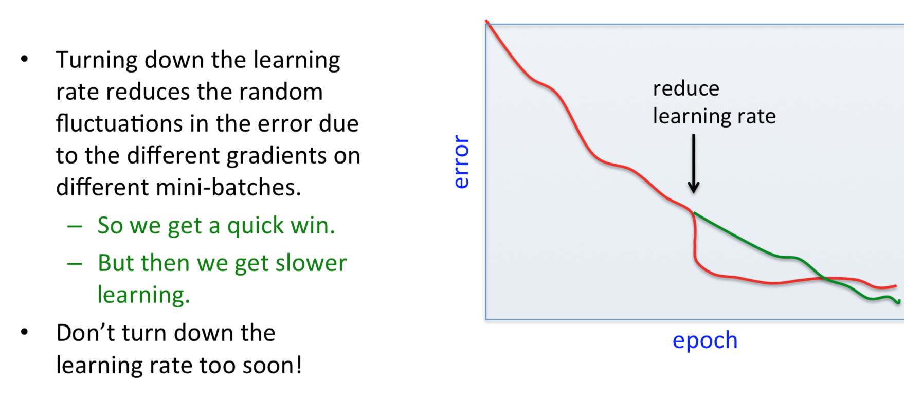
