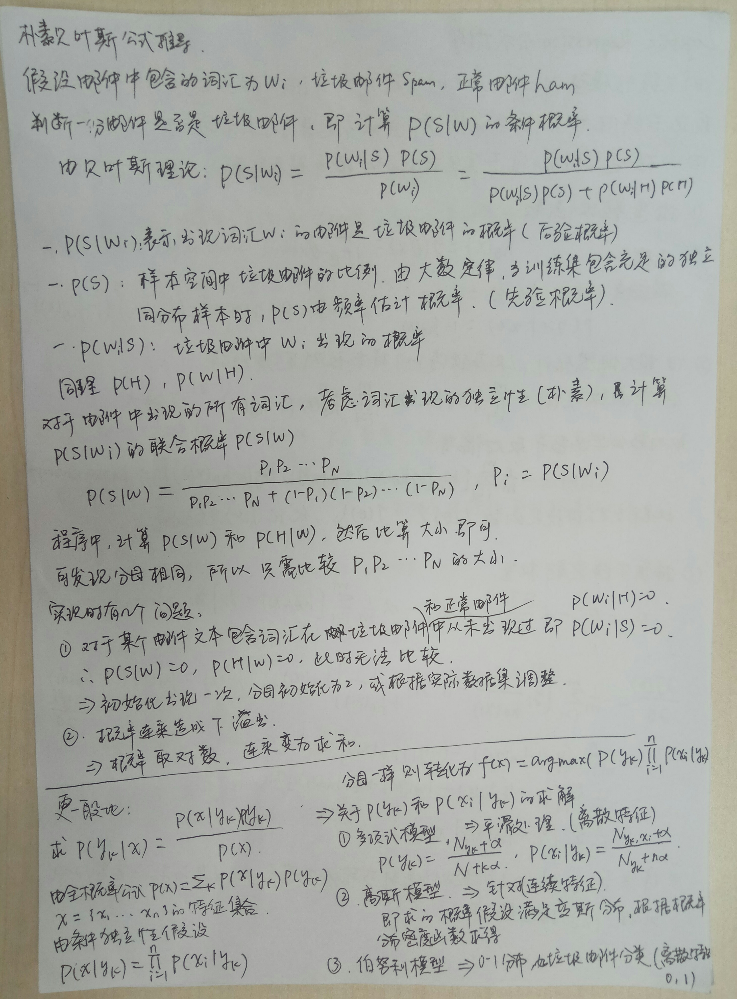

# Naive Bayesian
## 1. 朴素贝叶斯算法的原理、公式推导、三种分布模型？

## 2. 拼写检查的基本原理
用户输入一个单词时，可能拼写正确，也可能拼写错误。如果把拼写正确的情况记做c（代表correct），拼写错误的情况记做 w（代表wrong），那么"拼写检查"要做的事情就是：在发生w的情况下，试图推断出c。换言之：已知w，然后在若干个备选方案中，找出可能性最大的那个c，也就是求`P(c|w)`的最大值。

根据贝叶斯定理，有：`P(c|w)=P(w|c)P(c)/P(w)`由于对于 **所有备选** 的 c 来说，对应的都是同一个 w，所以它们的 P(w) 是相同的，因此我们只要最大化 `P(w|c)P(c)`即可。其中：

P(c) 表示某个正确的词的出现"概率"，如果我们有一个足够大的文本库，根据大数定律，那么这个文本库中每个单词的出现频率，就相当于它的发生概率。某个词的出现频率越高，P(c)就越大。比如在你输入一个错误的词“Julw”时，系统更倾向于去猜测你可能想输入的词是“July”，而不是“Jult”，因为“July”更常见。

P(w|c)表示在试图拼写c的情况下，出现拼写错误 w 的概率。为了简化问题，假定两个单词在字形上越接近，就有越可能拼错，P(w|c)就越大。举例来说，相差一个字母的拼法，就比相差两个字母的拼法，发生概率更高。你想拼写单词July，那么错误拼成Julw（相差一个字母）的可能性，就比拼成Jullw高（相差两个字母）。值得一提的是，一般把这种问题称为“编辑距离”

所以，我们比较所有拼写相近的词在文本库中的出现频率，再从中挑出出现频率最高的一个，即是用户最想输入的那个词。

总结步骤如下：
1. 根据用户输入的单词，计算与词汇列表各个词汇的编辑距离，选择较小的词汇作为候选集合；
2. 计算候选集中的词汇在文本库中出现的频率作为概率（此即 P(w|c)），选择概率最高的作为修正的词汇；
3. 更复杂一点的，如果用户已经输入了一定的上下文，此时可结合语言模型来增强拼写纠错的性能，比如结合 n-gram 的统计语言模型，计算依据当前上下文，下一个词汇出现概率。
