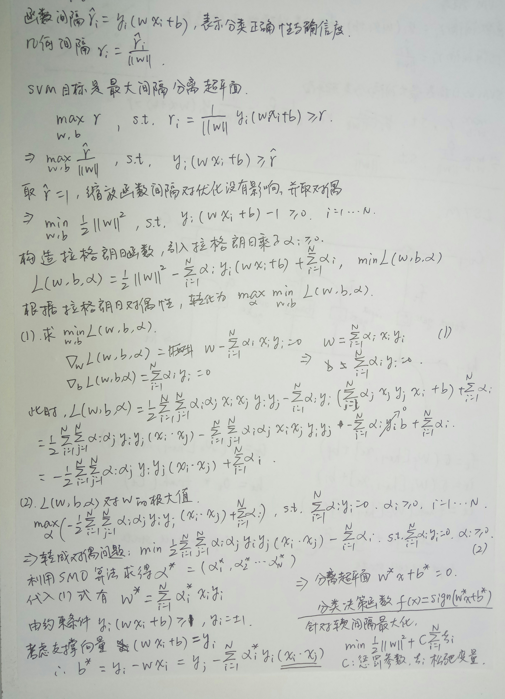
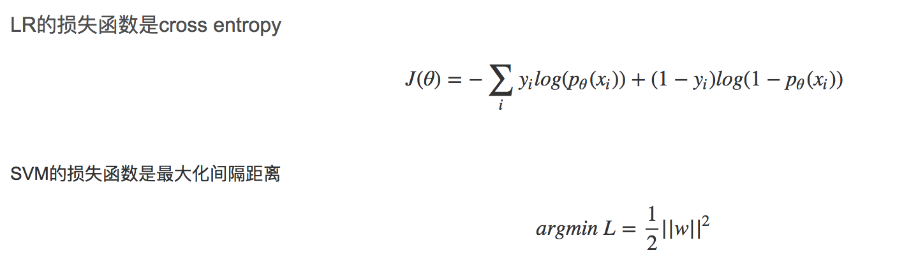

# SVM
## 1. SVM公式推导

## 2. Linear SVM 和 LR 有什么异同？
相同点：

1. LR和SVM都是分类算法。
2. 如果不考虑核函数，LR和SVM都是线性分类算法，即分类决策面都是线性的。
3. LR和SVM都是监督学习算法。

不同点：

1. 本质上是其loss function不同。LR 的损失函数为交叉熵损失函数，SVM 的损失函数为 Hinge loss 损失函数
> 
> 

2. 从数据分布对模型影响的角度上来说：支持向量机只考虑局部的边界线附近的点（支持向量），而逻辑回归考虑所有的样本点。所以线性SVM不直接依赖于数据的所有分布，分类平面不受一类点影响，而LR由于是用所有样本的概率最后做极大似然估计因此会受到所有数据点的影响，LR训练前要对不平衡数据先做balance；SVM对不平衡的影响更鲁棒，因为它的训练思想的本质就是最小距离最大化，不平衡对它影响较小。
3. Linear SVM依赖数据表达的距离测度，所以需要对数据先做normalization；LR不受其影响;
4. LR可以给出每个点属于每一类的概率，而SVM是非概率的。
5. 在解决非线性问题时，支持向量机采用核函数的机制，而LR通常不采用核函数的方法。
> 分类模型的结果就是计算决策面，模型训练的过程就是决策面的计算过程。通过上面的第二点不同点可以了解，**在计算决策面时，SVM算法里只有支持向量少数几个代表支持向量的样本参与了计算，也就是只有少数几个样本需要参与核计算。** 然而，**LR算法里，每个样本点都必须参与决策面的计算过程，也就是说，假设我们在LR里也运用核函数的原理，那么每个样本点都必须参与核计算，这带来的计算复杂度是相当高的。** 所以，在具体应用时，LR很少运用核函数机制。​
>
> Κ(x,y)=φ(x)∙φ(y), Κ(x,y)为核函数，φ(x)为映射函数，φ(x)∙φ(y)为x,y映射到特征空间上的内积

6. SVM的损失函数就自带正则！！！（损失函数中的1/2||w||^2项），这就是为什么SVM是结构风险最小化算法的原因！！！而LR必须另外在损失函数上添加正则项！！！
> 

7. 对于小规模数据集，SVM的效果要好于LR，但是大数据中，SVM的计算复杂度受到限制，而LR因为训练简单，可以在线训练，所以经常会被大量采用。

  - 如果Feature的数量很大，跟样本数量差不多，这时候选用LR或者是Linear Kernel的SVM
  > 理由：特征数相对于训练样本数已经够大了，使用线性模型就能取得不错的效果，不需要过于复杂的模型；

  - 如果Feature的数量比较小，样本数量一般，不算大也不算小，选用SVM+Gaussian Kernel
  > 理由：在训练样本数量足够大而特征数较小的情况下，可以通过使用复杂核函数的SVM来获得更好的预测性能，而且因为训练样本数量并没有达到百万级，使用复杂核函数的SVM也不会导致运算过慢；

  - 如果Feature的数量比较小，而样本数量很多，需要手工添加一些feature变成第一种情况
  > 理由：因为训练样本数量特别大，使用复杂核函数的SVM会导致运算很慢，因此应该考虑通过引入更多特征，然后使用线性核函数的SVM或者lr来构建预测性更好的模型。
