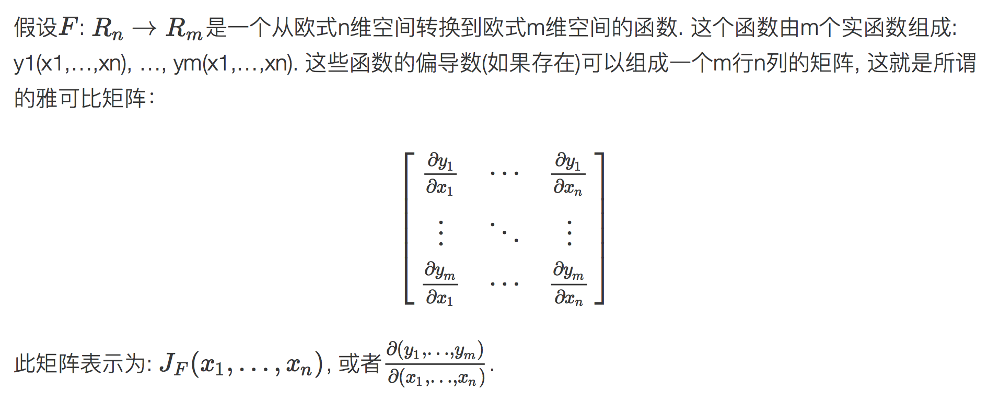
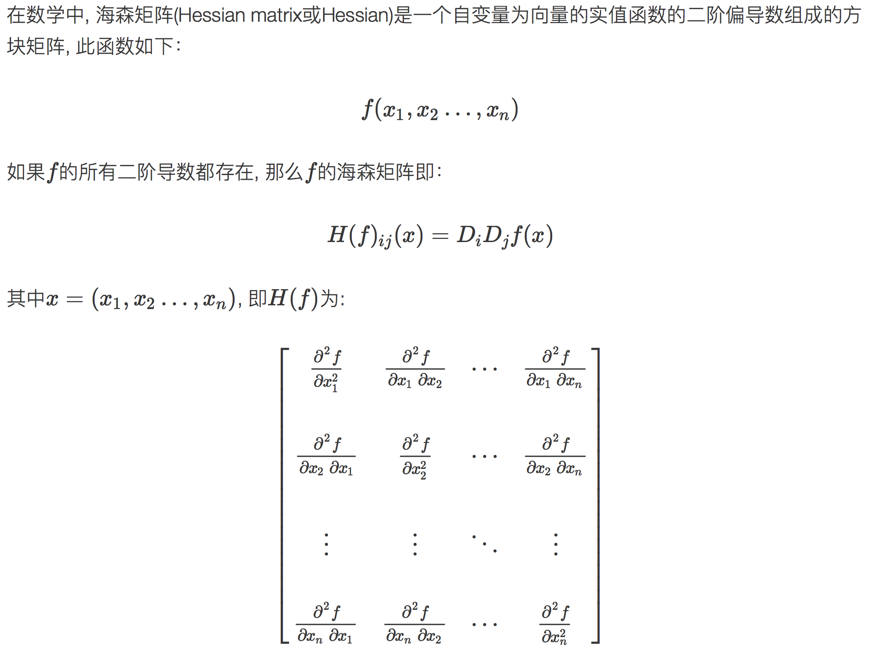
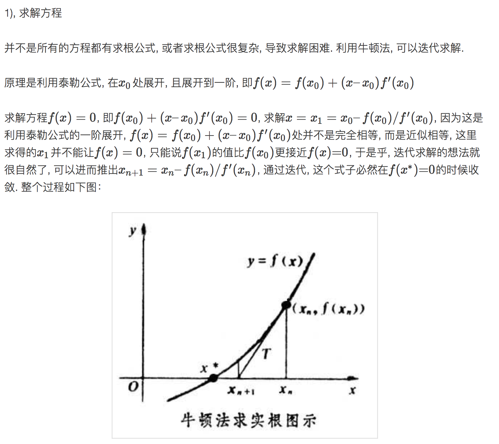
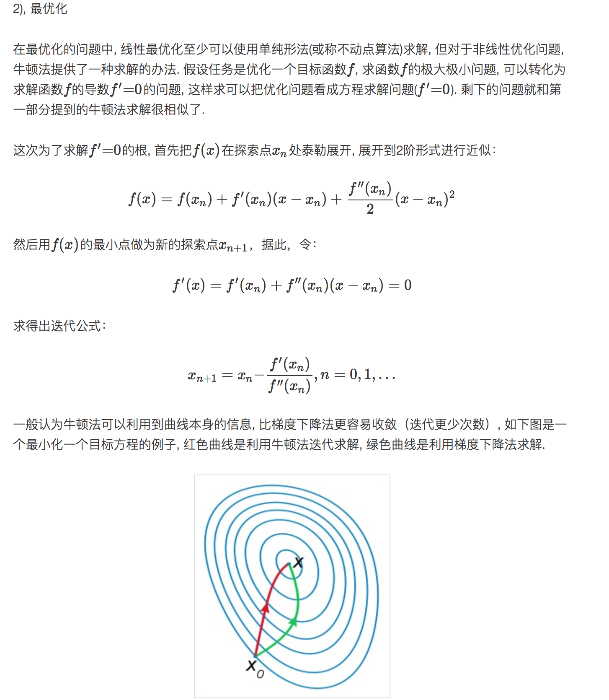

# 矩阵相关
## 1. Jacobian 和 Hessian 矩阵及其在深度学习中的重要性?
（1）Jacobian 矩阵

雅可比矩阵的重要性在于它体现了一个可微方程与给出点的最优线性逼近. 因此, 雅可比矩阵类似于多元函数的一阶偏导数。

（2）Hessian 矩阵

（3）海森矩阵在牛顿法中的应用

一般来说, 牛顿法主要应用在两个方面, 1, 求方程的根; 2, 最优化.

（4）二阶导数 Hessian 矩阵还可以用来判断一个临界点是否是局部极大值点、局部极小值点或鞍点。

##
